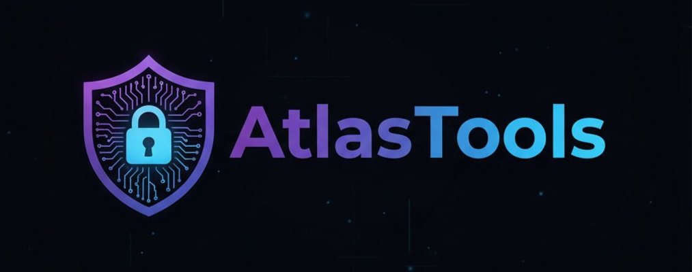
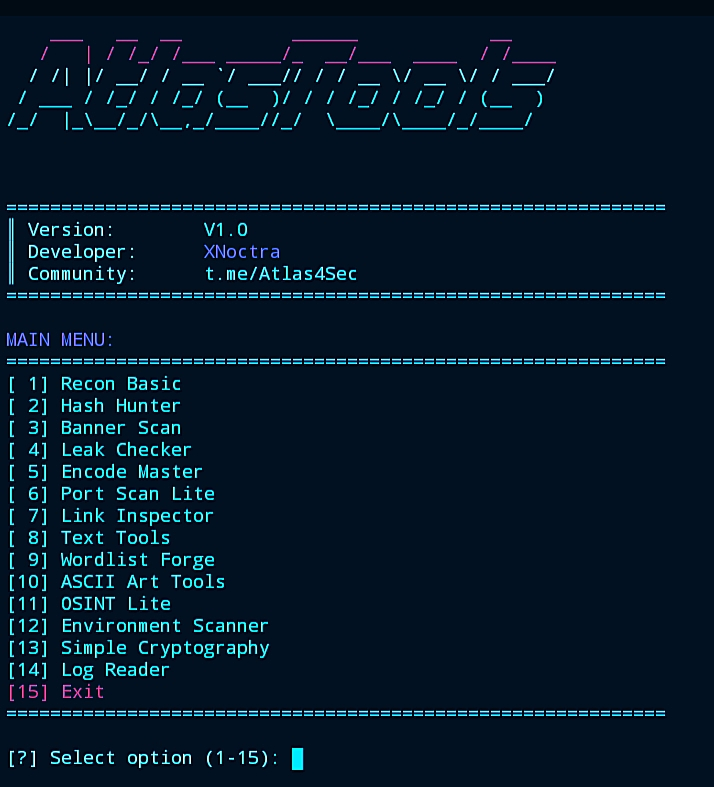

# 🔥 AtlasTools V1.0

<p align="center">
  
  <br>
  <strong>All-in-One Security Toolkit for Termux & Linux</strong>
</p>

<div align="center">


</div>

## 🎯 Overview

**AtlasTools V1.0** is a powerful multi-functional security toolkit designed specifically for cybersecurity enthusiasts. With 14 integrated tools in one beautiful interface, it provides everything you need for security testing, reconnaissance, and analysis.

---

## ✨ Features

<p align="center">
  
</p>

### 🛠️ **Security Tools**
- **🔍 Recon** - Basic reconnaissance (headers, ping, DNS, admin finder)
- **🔐 Hash Hunter** - MD5/SHA1/SHA256 cracker + Indonesian wordlists
- **🏷️ Banner Scan** - Server detection + OS fingerprinting
- **🕵️ Leak Checker** - Offline password leak database
- **🔠 Encode Master** - Base64/32/Hex/URL/ROT13 encoding
- **🌐 Port Scan Lite** - Fast port scanner with JSON export
- **🔗 Link Inspector** - URL analysis & phishing detection
- **📝 Text Tools** - JSON/HTML tools + wordlist management
- **🔨 Wordlist Forge** - Smart wordlist generator
- **🎨 ASCII Art Tools** - Text to ASCII art + patterns
- **🔎 OSINT Lite** - Username/email pattern generator
- **🔍 Env Scanner** - .env file & API key scanner
- **🔐 Simple Crypt** - XOR encryption + hash generator
- **📊 Log Reader** - Log beautifier with color coding

---

## 🚀 Quick Installation

### **For Termux (Android):**
```bash
pkg update && pkg upgrade
pkg install python python-pip git
git clone https://github.com/XNoctra/AtlasTools
cd AtlasTools
chmod +x AtlasTools.py
python3 AtlasTools.py
```

### **For Linux/Debian/Ubuntu:**
```bash
sudo apt update
sudo apt install python3 python3-pip git
git clone https://github.com/XNoctra/AtlasTools
cd AtlasTools
chmod +x AtlasTools.py
python3 AtlasTools.py
```

### **One-Command Install:**
```bash
# Termux
pkg update && pkg upgrade -y && pkg install python python-pip git -y && git clone https://github.com/XNoctra/AtlasTools && cd AtlasTools && chmod +x AtlasTools.py && python3 AtlasTools.py

# Linux
sudo apt update && sudo apt install python3 python3-pip git -y && git clone https://github.com/XNoctra/AtlasTools && cd AtlasTools && chmod +x AtlasTools.py && python3 AtlasTools.py
```

---

## 📱 Why AtlasTools?

### ✅ **Perfect for Termux**
- No heavy dependencies
- No native libraries needed
- Works offline
- Auto-install modules

### 🎨 **Beautiful Interface**
- Gradient color scheme
- ASCII art banner
- Smooth animations
- Clean menu layout

### ⚡ **Lightning Fast**
- Optimized for mobile
- Minimal resource usage
- Quick startup time

### 🛡️ **All Tools Work**
- 14 fully functional tools
- No broken features
- Regular updates
- Community tested

---

## 🎮 How to Use

1. **Run the tool:**
   ```bash
   python3 AtlasTools.py
   ```

2. **Choose from menu:**
   - Type number (1-15)
   - Follow on-screen instructions
   - Press Enter to continue

3. **Example:**
   ```
   [?] Select option (1-15): 1
   [?] Enter target: example.com
   ```

---

## 🔧 Requirements

| Module | Purpose | Status |
|--------|---------|--------|
| `requests` | HTTP requests | ✅ Auto-install |
| `pyfiglet` | ASCII banners | ✅ Auto-install |
| `colorama` | Terminal colors | ✅ Auto-install |

**All modules install automatically on first run!**

---

## ⚠️ Legal & Ethics

**Educational Use Only!**

🔒 **Authorized Use:**
- Security research
- Educational purposes
- Authorized penetration testing
- Personal system testing

🚫 **Prohibited:**
- Unauthorized access
- Illegal activities
- Harassment
- Privacy violation

**By using AtlasTools, you agree to use it responsibly and legally.**

---

## 🤝 Join Community

**Telegram:** [@Atlas4Sec](https://t.me/Atlas4Sec)

**Developer:** XNoctra  
**Version:** 1.0  
**Last Update:** December 2025

---

<div align="center">

### ⭐ If you like this project, give it a star! ⭐

**Made with ❤️ for the cybersecurity community**


</div>
